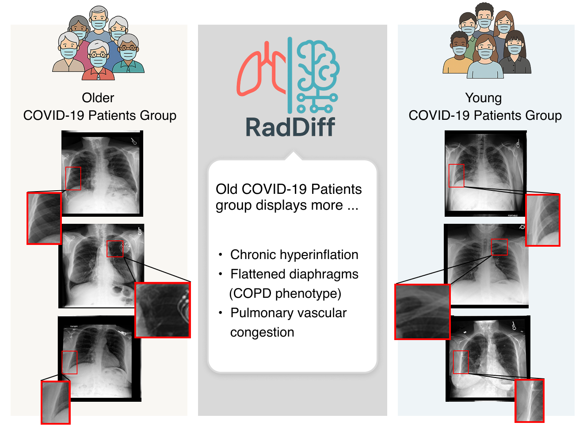

# RadDiff: Describing Differences in Radiology Image Sets with Natural Language

[](https://lbesson.mit-license.org/)
[](https://www.python.org/downloads/release/python-311/)
[](https://pytorch.org/get-started/previous-versions/#v21)
[](https://github.com/ambv/black)

This repo provides the PyTorch source code of our paper: [RadDiff: Describing Differences in Radiology Image Sets with Natural Language](https://arxiv.org/abs/2601.03733).


## 🔮 Abstract

Understanding how two radiology image sets differ is critical for generating clinical insights and for interpreting medical AI systems. We introduce RadDiff, a multi-modal agentic system that performs radiologist-style comparative reasoning to describe clinically meaningful differences between paired radiology studies. RadDiff builds on a proposer-ranker framework from VisDiff, and incorporates four innovations inspired by real diagnostic workflows: (1) medical knowledge injection through domain-adapted vision-language models; (2) multimodal reasoning that integrates images with their clinical reports; (3) iterative hypothesis refinement across multiple reasoning rounds; and (4) targeted visual search that localizes and zooms in on salient regions to capture subtle findings. To evaluate RadDiff, we construct RadDiffBench, a challenging benchmark comprising 57 expert-validated radiology study pairs with ground-truth difference descriptions. On RadDiffBench, RadDiff achieves 47% accuracy, and 50% accuracy when guided by ground-truth reports, significantly outperforming the general-domain Vis-Diff baseline. We further demonstrate RadDiff’s versatility across diverse clinical tasks, including COVID-19 phenotype comparison, racial subgroup analysis, and discovery of survival-related imaging features. Together, RadDiff and RadDiffBench provide the first method-and-benchmark foundation for systematically uncovering meaningful differences in radiological data.

</img>

## 🚀 Getting Started


1. Install dependencies:
  ```bash
  pip install -r requirements.txt
  ```

2. Set up environment variables by creating a `.env` file in `RadDiff_main/`:
  ```bash
  OPENAI_API_KEY='your-openai-api-key'
  ```

3. Login to your [wandb](https://wandb.ai) account:
  ```bash
  wandb login
  ```


## 💼 Customized Usage

If you want to use RadDiff on your own datasets, you can follow the following steps.

### 1. Convert Datasets

Convert your dataset to CSV format with two required columns `path` and `group_name`. An example of the CSV files can be found in [RadDiffBench/RadDiffBench.csv](RadDiff_main/RadDiffBench/RadDiffBench.csv).

Also convert your dataset to JSONL format with four required fields `set1`, `set2`, `set1_images`, and `set2_images`. An example of the JSONL files can be found in [RadDiffBench/RadDiffBench.jsonl](RadDiff_main/RadDiffBench/RadDiffBench.jsonl).

### 2. Define Configs

To describe the differences between two radiology datasets, RadDiff builds on a proposer-ranker framework. We then extend it using four innovations inspired by real diagnostic work-flows: (1) medical knowledge injection through domain-adapted vision-language models; (2) multimodal reasoning that integrates images with their clinical reports; (3)iterative hypothesis refinement across multiple reasoning
rounds; and (4) targeted visual search that localizes and zooms in on salient regions to capture subtle findings.

We have implemented different proposers and rankers in [components/proposer.py](RadDiff_main/components/proposer.py) and [components/ranker.py](RadDiff_main/components/ranker.py). To use RadDiff, you can use the default arguments in [configs/raddif_base.yaml](RadDiff_main/configs/raddiff_base.yaml), or you can edit the arguments to tailor to your own needs. 


### 3. Setup Servers

We unify all the LLMs, MLLMs, and CheXzero to API servers for faster inference. Follow the instructions in [serve/README.md](RadDiff_main/serve/README.md) to start these servers.

For the default configuration (CheXagent + GPT-4 as proposer and CheXzero as ranker), you need to start the following servers from the `RadDiff_main/` directory:
```bash
python serve/chexzero_server.py
python serve/vlm_server_chexagent.py 
```

### 4. Describe Differences

Finally, you can run the following command from the `RadDiff_main/` directory to describe the differences between two datasets:
```bash
python main.py --config configs/example.yaml
```

You can create your own config file similar to [raddiff_base.yaml](RadDiff_main/configs/raddiff_base.yaml) and customize the proposer, ranker, and data settings.

## 📄 Reproduce Paper Results

### 📊 RadDiffBench

To evaluate our system, we collected RadDiffBench, a benchmark of 57 expert-validated radiology study pairs with ground truth difference descriptions. The benchmark metadata can be found in [RadDiffBench file](RadDiff_main/RadDiffBench/RadDiffBench.csv).

To evaluate performance on RadDiffBench, we ask RadDiff to output a description for each paired set and compare it to the ground truth using [GPT-4.1-nano evaluator](RadDiff_main/components/evaluator.py).

#### Setup RadDiffBench

1. Download the MIMIC-CXR dataset from [PhysioNet](https://physionet.org/content/mimic-cxr/2.1.0/) (requires credentialed access)
2. Update the data paths in your `.env` file to point to your MIMIC-CXR installation

#### Reproducing Paper Results

All cached model outputs used to reproduce the exact results reported in the RadDiff paper (LLM, VLM, and CLIP caches) are hosted on [Hugging Face](https://huggingface.co/datasets/hercysn/RadDiff-paper-cache).

To fully reproduce the paper results:
1. Download the cache from Hugging Face
2. Place the cache in the `RadDiff_main/cache/` directory
3. Use the `normalize_path_for_hash` function in [utils_general.py](RadDiff_main/serve/utils_general.py) to ensure consistent cache key retrieval

#### Running Evaluation

From the `RadDiff_main/` directory, run:
```bash
python sweeps/sweep_pairedimagesets_parallel.py
```

### 💎 Applications (Section 6 in Paper)

For each application, we provide the corresponding codes and usages in [application](RadDiff_main/application/) folder.

## 📝 License

This project is licensed under the MIT License - see the [LICENSE](RadDiff_main/LICENSE) file for details.

## 🎯 Citation

If you use this repo in your research, please cite it as follows:
```
@article{RadDiff,
  title={RadDiff: Describing Differences in Radiology Image Sets with Natural Language},
  author={Xiaoxian Shen and Yuhui Zhang and Sahithi Ankireddy and Xiaohan Wang and Maya Varma and Henry Guo and Curtis Langlotz and Serena Yeung-Levy},
  journal={arXiv preprint arXiv:2601.03733},
  year={2026}
}
```
